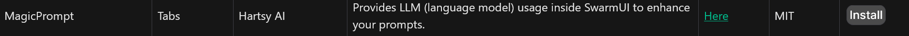
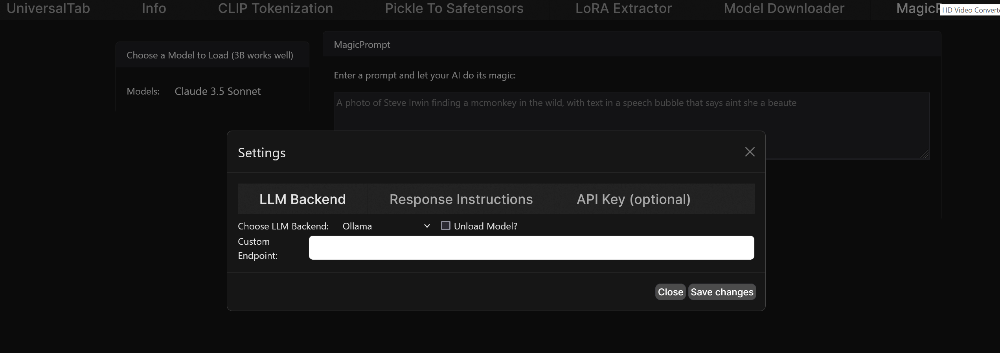
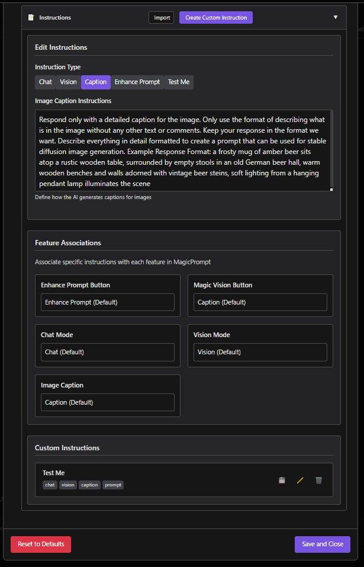
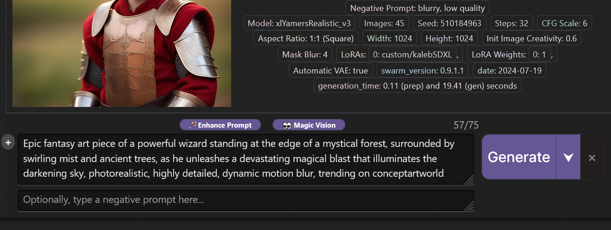
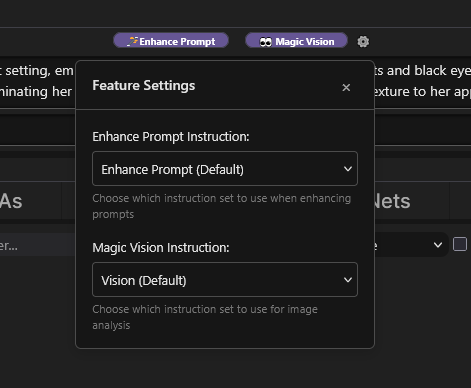
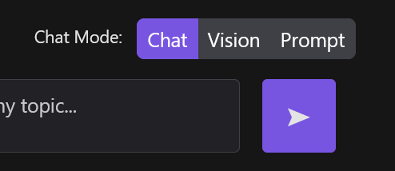
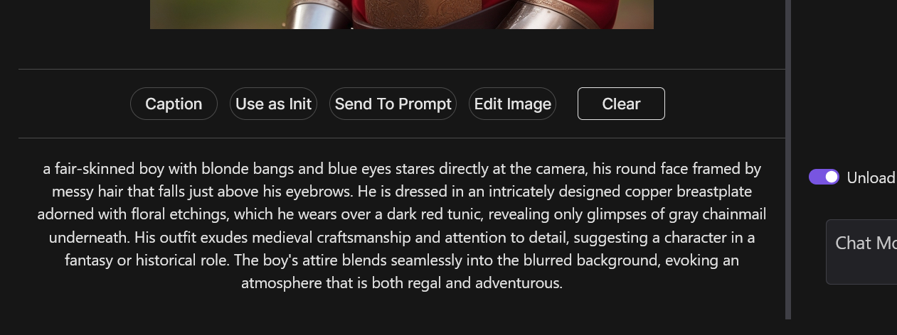

# SwarmUI MagicPrompt Extension
===========================================================================


## Table of Contents
-----------------

1. [Introduction](#introduction)
2. [Features](#features)
3. [Prerequisites](#prerequisites)
4. [Installation](#installation)
5. [Usage](#usage)
6. [Configuration](#configuration)
7. [Troubleshooting](#troubleshooting)
8. [Changelog](#changelog)
9. [License](#license)
10. [Contributing](#contributing)
11. [Acknowledgments](#acknowledgments)

## Introduction
---------------

The MagicPrompt Extension provides a simple and intuitive way directly in SwarmUI to generate text prompts for Stable Diffusion images. This uses your free local or paid API LLMs.


> [!WARNING]
> Always back up your SwarmUI configuration before making changes.
> To use 3rd party APIs, you must have an API key. You can get one from OpenAI, OpenRouter or Anthropic. These cost money to use per request but allow you to save precious VRAM.

## Features
------------

* Generate and rewrite prompts for text-to-image models.
* Supports various LLM backends including local Ollama, OpenAI-compatible APIs, OpenRouter, OpenAI, Anthropic, Grok (xAI), and Groq.
* Provides an intuitive interface within SwarmUI, including a button in the Generate tab and a dedicated MagicPrompt tab.
* Includes vision support, allowing you to upload images, generate captions, and use images as context for prompts.
* Compatible with other SwarmUI extensions.
* Add Custom AI Instructions and map them to specific features, see [configuration](#configuration) for more details
* Can automatically pass your prompt to an LLM, see [generate tab integration](#generate-tab-integration) for more details

### Vision Support
The extension now includes comprehensive vision support, allowing you to interact with language models using images. Key features include:

* **Image Upload**: Upload images directly within the MagicPrompt tab using drag and drop or the upload button.
* **Visual Modes**: Interact with uploaded images in different modes each mode uses separate system instructions:
    * **Vision Mode**: Ask questions about the image or request detailed analysis.
    * **Caption Mode**: Generate detailed captions for the uploaded image.
* **Vision Actions**: A set of actions to perform on the uploaded image, including generating captions, using the image as an init image, sending the image to the prompt, and clearing the image.
* **Backend Support**: Supports various vision backends, including Ollama, OpenRouter, OpenAI API, OpenAI (ChatGPT), and Anthropic (Claude).
* **Settings**: Configure vision-specific settings separate from chat models such as selecting the backend and model, and setting API keys.

### Generate Tab Integration
The MagicPrompt Extension now integrates directly with SwarmUI's prompt parsing system, providing seamless batch processing capabilities:

* **Automatic Parameter Group**: A new "Magic Prompt Auto Enable" parameter group appears in the sidebar interface when the extension is installed.
* **Prompt Tag Processing**: Use `<mpprompt:your prompt here>` tags directly in your prompts for automatic LLM processing during generation. Only what is in this tag will be sent to your LLM. The response will replace the tag.
* **Attaching the Original Prompt**: Use `<mporiginal>` to add your original, unmodified tags back to your prompt. This can useful if your model works better with the original tag-based prompt.
* **Smart Caching**: The "MP Use Cache" parameter allows you to cache LLM responses for identical prompts, significantly improving performance and reducing API costs during batch generation. Use alongside the Wildcard Seed Generation feature below for more powerful caching!
* **Wildcard Seed Generation**: The "MP Generate Wildcard Seed" parameter generates new wildcard seeds for each batch, perfect for creating varied results while reusing cached LLM responses. If your prompts contain `<wildcard>` or `<wc>` tags, and you run a batch of multiple images, the same wildcard selections will be chosen, ensuring your prompts are the same and the LLM is called only once per batch.
* **Model Selection**: Choose different LLM models for each batch using the "MP Model ID" parameter.
* **Instruction Selection**: Select custom instructions for each batch using the "MP Instructions" parameter.

## Prerequisites
----------------

Before you install the MagicPrompt Extension, ensure that you have the following prerequisites:

* You need to have SwarmUI installed on your system. If you don't have it installed, you can download it from [here](https://github.com/mcmonkeyprojects/SwarmUI).
* Remove the HartsyCore Extension if you have it installed. It was removed to comply with the SwarmUI extension guidelines.
* This extension assumes you have a working and setup local Ollama LLM API server or a compatable equilavent that uses OpenAi API format and you know the URL to make API calls. If you do not have this installed follow the instructions on their [GitHub](https://github.com/ollama/ollama).
* Alternatively, you can use OpenAI or Anthropic LLM API servers. You will need an API key for these services.

## Installation
--------------

Automatic Install (recommended):

Follow these steps to start making magic:

1. Open your SwarmUI instance and navigate to the `Server -> Extensions` tab.
2. Find the extension on the list. 

3. Click the install button and let it download.
4. Follow the prompts to restart Swarm. 
5. Configure the extension as described in the [Configuration](#configuration) section.

Manual Installation (not recommended):

Read through everything before attempting to install. Then, follow these steps:

1. Close your SwarmUI instance and navigate to `SwarmUI/src/Extensions` directory and clone the repo there. Open cmd `cd` to the directory above and `git clone ` the repo.
2. Make sure you have run `update-windows.bat` or `update-linuxmac.sh` to recompile SwarmUI. This only needs to be done on first install.
3. Restart your SwarmUI instance and refresh your browser. You should now have a tab called MagicPrompt. You will also see two new buttons in the Generate tab above the prompt box.
4. Configure the extension as described in the [Configuration](#configuration) section.

## Configuration
----------------

The MagicPrompt Extension can be used with any LLM model that works on the supported backends.

> [!NOTE]
> Looking for a free LLM API? MagicPrompt supports [OpenRouter](https://openrouter.ai/). You will need to sign up to get an API key but you 
> do NOT have to add any payment details. They have several models available for free. (rate limits apply)

1. Open the MagicPrompt tab and click the settings button. This will open the settings modal and you will see all of the options. If you are using Ollama with the default localhost and port You can just start by selecting a model for both the chat and vision settings.


**Chat Settings:**
* **Chat Backend:** Choose your preferred LLM backend (e.g., Ollama, OpenAI, Anthropic).
* **Chat Model:** Choose the specific model you want to use.
* **Base URL:** Enter the URL for your LLM API server (e.g., `http://localhost:11434` for local Ollama).

> [!NOTE]
> Chat and Vision settings are linked by default. If you would like to use different models for each, you can toggle this in settings.

**Vision Settings:**
* **Vision Backend:** Choose your preferred LLM vision backend (e.g., Ollama, OpenAI, Anthropic).
* **Vision Model:** Choose the specific vision model you want to use.
* **Base URL:** Enter the base URL for your vision API if required.

**Instruction System:**
The MagicPrompt Extension now features a flexible instruction system that allows you to customize how the AI responds in different contexts:



* **Built-in Instructions:** Four primary instruction types are included:
  * **Chat Instructions:** Controls how the AI behaves in chat conversations.
  * **Vision Instructions:** Determines how the AI analyzes and describes images.
  * **Image Caption Instructions:** Guides how the AI generates captions for uploaded images.
  * **Text-to-Image Prompt Instructions:** Defines how the AI enhances and formats your prompts.

* **Custom Instructions:** Create your own specialized instructions for specific tasks:
  * Click the "Create Custom Instruction" button in the Instructions tab.
  * Provide a title, description, and the instruction content.
  * Assign your instruction to relevant categories (chat, vision, caption, prompt).
  * Optionally use AI assistance to help generate the instruction content.

* **Feature Mapping:**
  * Connect specific features to instruction sets through the "Features" tab.
  * For example, you can set which instruction set the "Enhance Prompt" button uses.
  * You can also configure feature mappings directly from the mini-settings panel accessed via the gear icon next to the buttons in the Generate tab.
  
* **Import/Export:**
  * Share custom instructions by exporting them as JSON files.
  * Import instructions created by others to extend your collection.

  Example:
  ```json
  {
    "id": "custom-1742830899626",
    "title": "Test Me",
    "content": "a big old test",
    "tooltip": "for testing",
    "categories": [
      "chat",
      "vision",
      "caption",
      "prompt"
    ],
    "created": "2025-03-24T15:41:39.627Z",
    "updated": "2025-03-24T15:41:39.627Z"
  }
2. **Save:**
* **Save and Close:** Save and close your selected settings.
* **Reset to Defaults:** This is the something is wrong button. Click it if something is wrong.

3. Verify that your settings have been applied correctly and that you have selected both a chat and vision model.

## Known working OpenAI API–compatible backends
-----------------------------------------------

These backends have been reported to work with the MagicPrompt "OpenAIAPI (LOCAL)" backend. URLs shown are the common defaults; adjust to your environment as needed.

| Name | Base URL | Type | Free tier | Recommended | Notes |
|---|---|---|---|---|---|
| Groq | https://api.groq.com/openai | API | Yes | Yes | Very fast; free tier available; supports Llama, Mixtral, Gemma variants. |
| KoboldCPP | http://localhost:5001 | Local | Yes (local) | Yes | Start with --api to expose OpenAI-compatible /v1 endpoints. |
| Oobabooga (text-generation-webui) | http://127.0.0.1:5000/v1 | Local | Yes (local) | Yes | Requires the OpenAI API extension enabled (exposes /v1). |
| LM Studio | http://localhost:1234/v1 | Local | Yes (local) | Yes | Enable the local server to use OpenAI-compatible endpoints. |

Notes:
- "Local" indicates a self-hosted server on your machine/LAN.
- If your server uses a non-default port/path, update the Base URL in MagicPrompt settings accordingly.
- For paid APIs, set your API key in SwarmUI Users → API Keys.

## Usage
--------

The MagicPrompt Extension offers multiple ways to enhance your prompts and interact with your LLM:

1. **Generate Tab Buttons**: Use the "Enhance Prompt" and "Magic Vision" buttons for quick prompt enhancement
2. **Dedicated MagicPrompt Tab**: Access full chat and vision capabilities
3. **Prompt Tag Processing**: Use `<mpprompt>` tags directly in your prompts to send to LLM, use `<mporiginal>` to re-add the original, unmodified tags to your processed prompt.

**Generate Tab:**


1. **Enter your prompt:** In the Generate tab, type your initial prompt in the positive prompt box.
2. **Use MagicPrompt:** Click the "Enhance Prompt" button to rewrite and enhance your prompt based on your configured settings. This will rewrite your prompt and replace it in the prompt box.

3. **Caption selected image:** Make sure you have an image selected and your caption instructions are giving you the response from your selected model you desire.
4. **Use Magic Vision:** Click the "Magic Vision" button and it will caption your image giving you (depending on your caption instructions) a prompt to generate a similar image.
5. **Quickly Change Instructions:** Click on the cog icon next to the MagicVision button to quickly change which system instruction is used. This is where you can swap between the defaults and your custom instructions.


**MagicPrompt Tab:**

1. **Access the tab:** Click on the tab and you will see how it is separated into two sections. The Vision and Chat sections.
2. **Chat:**
**Select a mode:** Choose between "Prompt", "Chat", and "Vision" modes using the radio buttons at the top. This will switch between your instructions and the vision mode will use the selected vision model.

**Chat LLM:** Chat with your AI of choice however you want. Just note it has no memory and is not intended to be a comprehensive chat app.
3. **Vision:**
**Upload Image:** Click the upload button and choose an image. If you have the auto caption toggle enabled it will start to make the API call using the caption instructions.
**Select an action:** Choose an action from the available buttons:

    * **Caption:** Generate a caption for the image.
    * **Use as Init:** Use the image as an initial image for your generation.
    * **Send to Prompt:** Send a description of the image to the prompt box.
    * **Edit Image:**  Edit the uploaded image (functionality details to be added).
    * **Clear:** Clear the uploaded image.

**Settings:**

* Access the settings by clicking the settings button within the MagicPrompt tab to configure various options, including the LLM backends, model selection, and custom system instructions.


## Troubleshooting
-----------------

If you encounter any issues check these common solutions before you open an issue on GitHub.

* Check the logs for any error messages or warnings.
* Ensure that the extension is properly installed and configured. Did you add your API URL or keys?
* If you are using any LLM service other than Ollama, I cannot guarantee that it will work. You may need to modify the code to work with your service. Feel free to enter a feature request to add support for your service.
* Ask me in the SwarmUI Discord server for help by creating a new post in [#help-forum](https://discord.com/channels/1243166023859961988/1255990493830057995/1255990493830057995). That is one of the places I live.
* If you still have issues, open an issue on GitHub or join the [Hartsy Discord Community](https://discord.gg/CA9kRdE7y8)

## Changelog
------------

* Version 0.1: Initial release
* Version 0.2: Added support for Ollama LLM API and removed Jan support
* Version 0.2.1: Fixed a bug where the extension would not work if the prompt was empty
* Version 0.2.2: Small bug fixes
* Version 0.3: Added a select menu to choose which model to use
* Version 0.4: Added a regenerate button if you did not like the rewritten prompt
* Version 0.5: changed the Instructions to be betterer
* Version 0.6: Changed the main tab to be Hartsy.AI (Branding is everything)
* Version 0.7: Updated the readme to be more informative
* Version 1.0: Initial public release
* Version 1.1: Added support for OpenAI and Anthropic LLM API servers as well as local OpenAI API servers
* Version 1.2: Added settings config window to allow for easier configuration of the extension
* Version 1.3: Added working Anthropic support and a new button in the Generate tab to rewrite prompts
* Version 1.4: Added support for OpenRouter API (requires API key)
* Version 2.0: Vision support and a rewrite of most of the extension
* Version 2.1: API keys are now handled in Users tab
* Version 2.2: Added custom instructions feature
* Version 2.3: Added Grok (xAI) backend support and documented known working OpenAI-compatible backends in README
* Version 2.4: Added T2I parameter integration with smart caching system, prompt tag processing (`<mpprompt>`), and wildcard seed generation for enhanced batch processing capabilities

## License
----------

Hartsy Extensions including this one are licensed under the [MIT License](https://opensource.org/licenses/MIT).

## Contributing
---------------

Contributions to the extension are welcome. Please ask before working on anything big. I may already be working on it.

Join the Discord server to ask questions or get help with the extension. You can also open an issue on GitHub if you encounter any bugs or have feature requests.
1. Fork the extension's repository on GitHub.
2. Make your changes and commit them to your fork.
3. Open a pull request and wait for a review.

## Acknowledgments
------------------

These extensions would not have been made without the existence of SwarmUI. I would like to thank the developer [mcmonkey](https://github.com/mcmonkey4eva) for being the GOAT he is.

Special thanks to the following people:

* [maedtb](https://github.com/maedtb) and [Jelosus1](https://github.com/Jelosus2), Thank you for the support on Discord.  
* [Hartsy AI](https://hartsy.ai) for the daily inspiration. If you work hard, dreams can come true. 
