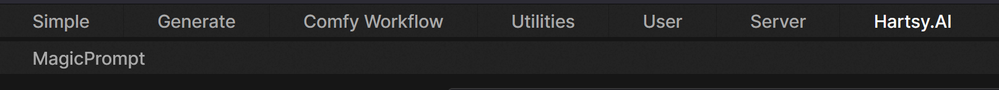
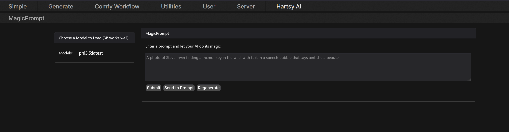
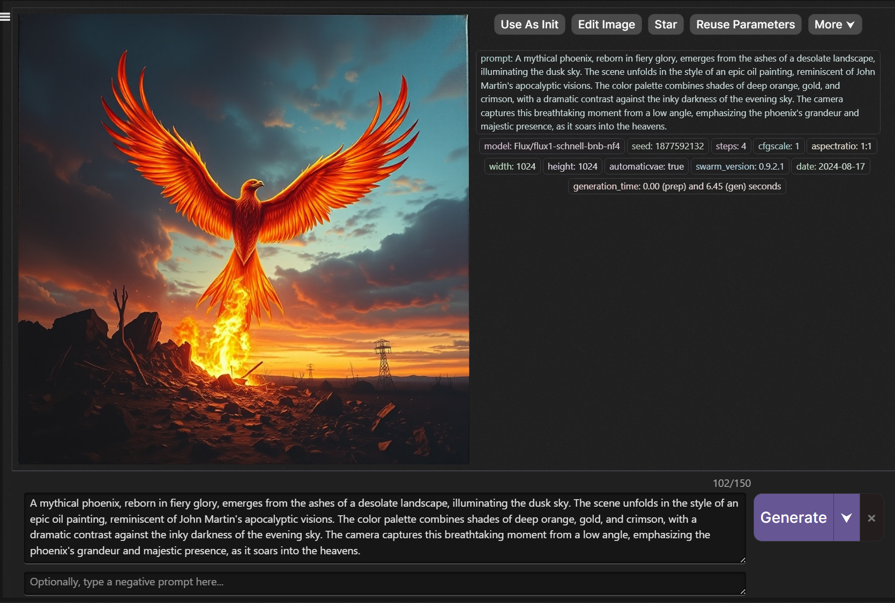

# SwarmUI MagicPrompt Extension
=============================================================================================

## Table of Contents
-----------------

1. [Introduction](#introduction)
2. [Features](#features)
3. [Prerequisites](#prerequisites)
4. [Installation](#installation)
5. [Usage](#usage)
6. [Configuration](#configuration)
7. [Troubleshooting](#troubleshooting)
8. [Changelog](#changelog)
9. [License](#license)
10. [Contributing](#contributing)
11. [Acknowledgments](#acknowledgments)

## Introduction
---------------

The MagicPrompt Extension provides a simple and intuitive way directly in SwarmUI to generate text prompts for Stable Diffusion images. This uses your local Ollama LLMs. 

## Features
------------

* Generate a rewritten prompt with more detail directly in SwarmUI
* Supports any models you have on your local Ollama LLM server
* Easy-to-use interface that will send the rewritten prompts to the Generate tab
* Compatible with other SwarmUI extensions from Hartsy.AI

## Prerequisites
----------------

Before you install the MagicPrompt Extension, ensure that you have the following prerequisites:

* You need to have SwarmUI installed on your system. If you don't have it installed, you can download it from [here](https://github.com/mcmonkeyprojects/SwarmUI).
* This extension assumes you have a working and setup local Ollama LLM API server and you know the URL to make API calls. If you do not have this installed follow the instructions on their [GitHub](https://github.com/ollama/ollama).

## Installation
--------------

To install the Extension real through all the steps before attempting to install. Then, follow these steps:

1. Close your SwarmUI instance and navigate to `SwarmUI/src/Extensions` directory and clone the repo there. Open cmd `cd` to the directory above and `git clone ` the repo.
2. Configure the extension as described in the [Configuration](#configuration) section.
3. Make sure you have run `update-windows.bat` or `update-linuxmac.sh` to recompile SwarmUI. This only needs to be done on first install.
4. Restart your SwarmUI instance and refresh your browser. You should now have a new tab called Hartsy.AI and a sub-tab called MagicPrompt.

## Configuration
----------------

The MagicPrompt Extension can be used with ay LLM model that is supported by Ollama. Currently only Ollama is supported:

1. Open the extension folder in your SwarmUI instance and open the `setup.json` file.
2. replace the `LlmEndpoint` with the your LLM API server IP. For most people you should change this to `http://localhost:11434`. If you want, replace the `Instructions` with your own.
3. Make sure you have at least 1 model downloaded and ready in your Ollama instance.
4. Save your changes and rebuild the SwarmUI project using the `update-windows.bat` or `update-linuxmac.sh` script.

## Usage
--------

1. When you open your SwarmUI instance, you will see a new tab called "Hartsy.AI". All our extensions will be under this tab.

2. Choose a model from the dropdown menu. Personally I like StableLM-Zephyr 3B.
3. Enter your crappy prompt in the box and click submit or hit enter. 

4. It will rewrite the prompt for your review.	

5. If you like the prompt, click send to prompt button and it will yeet it to the Generate tab and fill in your prompt box.

6. If you do not like it enter a new prompt or click the regenerate button to get a new version of your original prompt. 
7. Profit.

## Troubleshooting
-----------------

If you encounter any issues check these common solutions before you open an issue on GitHub.

* Check the logs for any error messages or warnings.
* Ensure that the extension is properly installed and configured. Did you add your API URL to the config.json file?
* If you are using any LLM service other than Ollama, I cannot guarantee that it will work. You may need to modify the code to work with your service. Feel free to enter a feature request to add support for your service.
* Ask me in the SwarmUI Discord server for help by creating a new post in [#help-fourm](https://discord.com/channels/1243166023859961988/1255990493830057995/1255990493830057995). That is one of the places I live.
* If you still have issues, open an issue on GitHub or join my [Dev Discord Server](https://discord.com/invite/5m4Wyu52Ek)

## Changelog
------------

* Version 0.1: Initial release
* Version 0.2: Added support for Ollama LLM API and removed Jan support
* Version 0.2.1: Fixed a bug where the extension would not work if the prompt was empty
* Version 0.2.2: Small bug fixes
* Version 0.3: Added a select menu to choose which model to use
* Version 0.4: Added a regenerate button if you did not like the rewritten prompt
* Version 0.5: changed the Instructions to be betterer
* Version 0.6: Changed the main tab to be Hartsy.AI (Branding is everything)
* Version 0.7: Updated the readme to be more informative
* Version 1.0: Initial public release

## License
----------

Kalebbroo Extensions including this one are licensed under the [MIT License](https://opensource.org/licenses/MIT).

## Contributing
---------------

Contributions to the extension are welcome. Please ask before working on anything big. I may already be working on it.

1. Fork the extension's repository on GitHub.
2. Make your changes and commit them to your fork.
3. Open a pull request and wait for a review.

## Acknowledgments
------------------

These extensions would not have been made without the existance of SwarmUI. I would like to thank the developer [mcmonkey](https://github.com/mcmonkey4eva) for being the GOAT he is.

Special thanks to the following people:

* [maedtb](https://github.com/maedtb) and [Jelosus1](https://github.com/Jelosus2), Thank you for the support on Discord.  
* [Hartsy AI](https://hartsy.ai) for the daily inspiration. If you work hard, dreams can come true. 
