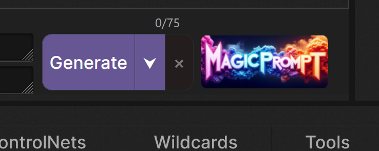
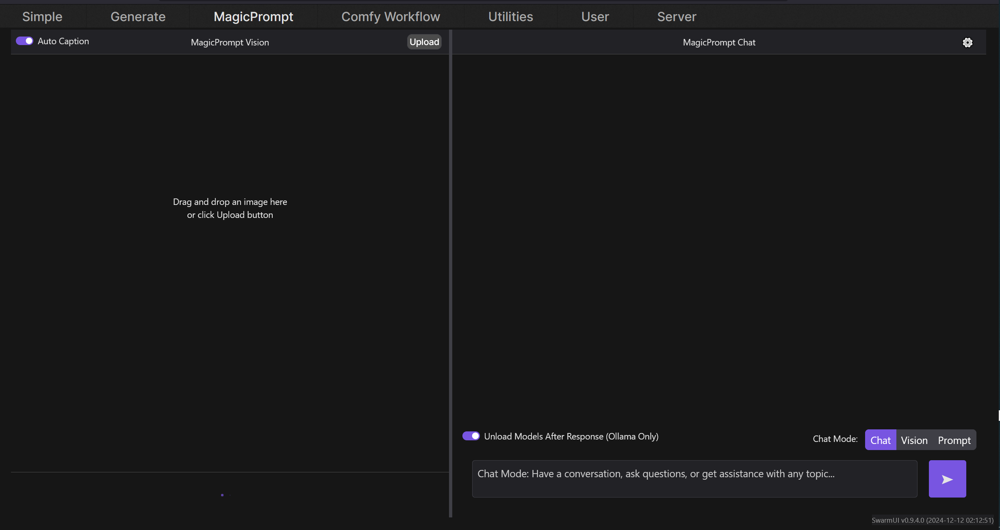
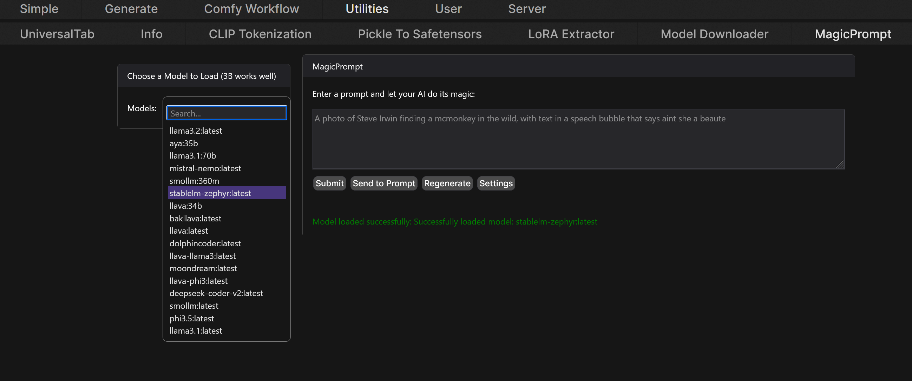
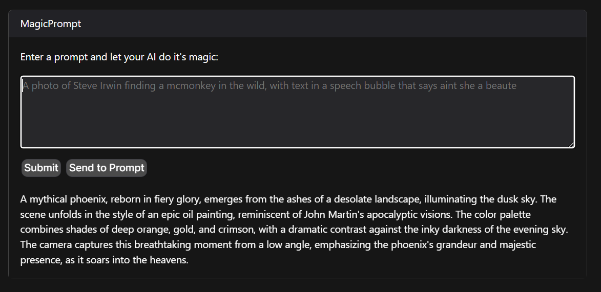
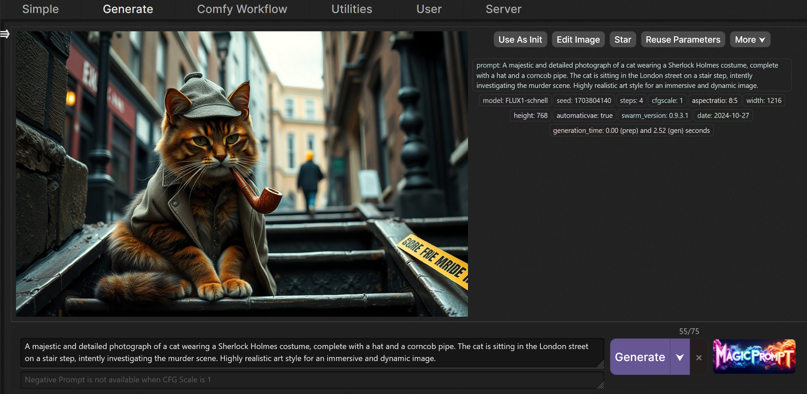

# SwarmUI MagicPrompt Extension
===========================================================================

## Table of Contents
-----------------

1. [Introduction](#introduction)
2. [Features](#features)
3. [Prerequisites](#prerequisites)
4. [Installation](#installation)
5. [Usage](#usage)
6. [Configuration](#configuration)
7. [Troubleshooting](#troubleshooting)
8. [Changelog](#changelog)
9. [License](#license)
10. [Contributing](#contributing)
11. [Acknowledgments](#acknowledgments)

## Introduction
---------------

The MagicPrompt Extension provides a simple and intuitive way directly in SwarmUI to generate text prompts for Stable Diffusion images. This uses your local Ollama LLMs. 

> [!WARNING]
> Uninstall and remove HartsyCore Extension. It was removed to comply with the SwarmUI extension guidelines.
> Always back up your SwarmUI configuration before making changes.
> To use 3rd party APIs, you must have an API key. You can get one from OpenAI or Anthropic. Those cost money to use per request.

## Features
------------

* Generate a rewritten prompt with more detail directly in SwarmUI
* Supports any models you have on your local Ollama LLM server, any local LLM server that uses OpenAI's API format, OpenRouter API (Has free models but requires API key), Open AI (Requires API key), and Anthropic (Requires API key).
* Easy-to-use interface with a button right in the Generate tab to rewrite the prompt. Or you can use the MagicPrompt tab for more control.
* Compatible with other SwarmUI extensions from Hartsy.AI

## Prerequisites
----------------

Before you install the MagicPrompt Extension, ensure that you have the following prerequisites:

* You need to have SwarmUI installed on your system. If you don't have it installed, you can download it from [here](https://github.com/mcmonkeyprojects/SwarmUI).
* Remove the HartsyCore Extension if you have it installed. It was removed to comply with the SwarmUI extension guidelines.
* This extension assumes you have a working and setup local Ollama LLM API server or a compatable equilavent that uses OpenAi API format and you know the URL to make API calls. If you do not have this installed follow the instructions on their [GitHub](https://github.com/ollama/ollama).
* Alternatively, you can use OpenAI or Anthropic LLM API servers. You will need an API key for these services.

## Installation
--------------

To install the Extension, read through all the steps before attempting to install. Then, follow these steps:

1. Close your SwarmUI instance and navigate to `SwarmUI/src/Extensions` directory and clone the repo there. Open cmd `cd` to the directory above and `git clone ` the repo.
2. Make sure you have run `update-windows.bat` or `update-linuxmac.sh` to recompile SwarmUI. This only needs to be done on first install.
3. Restart your SwarmUI instance and refresh your browser. You should now have a sub-tab called MagicPrompt inside of the Utilities tab. You will also see a new MagicPrompt button in the Generate tab.
4. Configure the extension as described in the [Configuration](#configuration) section.

## Configuration
----------------

The MagicPrompt Extension can be used with any LLM model that works on the supported backends.

> [!NOTE]
> Looking for a free LLM API? MagicPrompt supports [OpenRouter](https://openrouter.ai/). You will need to sign up to get an API key but you 
> do NOT have to add any payment details. They have several models available for free.

1. Open the Utilities/MagicPrompt tab in SwarmUI and find and click the settings button. This will open a window with three tabs (LLM Backend, Response Instructions, and API Key)
** LLM Backend: 
* Choose a backend from the dropdown menu. 
* Check the checkbox if you want to have the model unload after you press send to prompt. This unloads the model from VRAM and will need to be reloaded to make another prompt.
* Enter your `LlmEndpoint` (LLM API server IP). For most people you should change this to `http://localhost:11434`. You can leave this blank if you are using a paid API.
** Response Instructions:
* Enter the instructions you want to give the model. This is what tells the LLM how and what format to rewrite the prompt in. Leave this blank to use the provided instructions.
** API Key:
* Choose which API you are using. OpenAI or Anthropic from the dropdown.
* Enter your API key for your selected API. Then, click save. This will save the key only no other settings are saved.
2. Save your changes by clicking the button at the bottom right and the window will close.
3. Check to make sure you did not encounter any errors and that you see a new list of available models in the dropdown menu.

## Usage
--------

1. When you open your SwarmUI instance, you will see a new button called "MagicPrompt" in the generate tab. This button will not work until you have entered your settings.

2. Click the Utilities tab and you should see a new sub-tab called MagicPrompt. Click that tab this is where you can adjust settings or change the model or backend.

2. Choose a model from the dropdown menu. Personally I like StableLM-Zephyr 3B.

3. Enter your crappy prompt in the box and click submit or hit enter. Or go to the Generate tab and type a prompt in the positive prompt box. Then, click the MagicPrompt button.
4. It will rewrite the prompt for your review.	

5. If you like the prompt, click send to prompt button and it will yeet it to the Generate tab and fill in your prompt box.

6. If you do not like it enter a new prompt or click the regenerate button to get a new version of your original prompt. 
7. Profit.

## Troubleshooting
-----------------

If you encounter any issues check these common solutions before you open an issue on GitHub.

* Check the logs for any error messages or warnings.
* Ensure that the extension is properly installed and configured. Did you add your API URL to the config.json file?
* If you are using any LLM service other than Ollama, I cannot guarantee that it will work. You may need to modify the code to work with your service. Feel free to enter a feature request to add support for your service.
* Ask me in the SwarmUI Discord server for help by creating a new post in [#help-fourm](https://discord.com/channels/1243166023859961988/1255990493830057995/1255990493830057995). That is one of the places I live.
* If you still have issues, open an issue on GitHub or join the [Hartsy Discord Community](https://discord.gg/nWfCupjhbm)

## Changelog
------------

* Version 0.1: Initial release
* Version 0.2: Added support for Ollama LLM API and removed Jan support
* Version 0.2.1: Fixed a bug where the extension would not work if the prompt was empty
* Version 0.2.2: Small bug fixes
* Version 0.3: Added a select menu to choose which model to use
* Version 0.4: Added a regenerate button if you did not like the rewritten prompt
* Version 0.5: changed the Instructions to be betterer
* Version 0.6: Changed the main tab to be Hartsy.AI (Branding is everything)
* Version 0.7: Updated the readme to be more informative
* Version 1.0: Initial public release
* Version 1.1: Added support for OpenAI and Anthropic LLM API servers as well as local OpenAI API servers
* Version 1.2: Added settings config window to allow for easier configuration of the extension
* Version 1.3: Added working Anthropic support and a new button in the Generate tab to rewrite prompts
* Version 1.4: Added support for OpenRouter API (requires API key)

## License
----------

Hartsy Extensions including this one are licensed under the [MIT License](https://opensource.org/licenses/MIT).

## Contributing
---------------

Contributions to the extension are welcome. Please ask before working on anything big. I may already be working on it.

Join the Discord server to ask questions or get help with the extension. You can also open an issue on GitHub if you encounter any bugs or have feature requests.
1. Fork the extension's repository on GitHub.
2. Make your changes and commit them to your fork.
3. Open a pull request and wait for a review.

## Acknowledgments
------------------

These extensions would not have been made without the existance of SwarmUI. I would like to thank the developer [mcmonkey](https://github.com/mcmonkey4eva) for being the GOAT he is.

Special thanks to the following people:

* [maedtb](https://github.com/maedtb) and [Jelosus1](https://github.com/Jelosus2), Thank you for the support on Discord.  
* [Hartsy AI](https://hartsy.ai) for the daily inspiration. If you work hard, dreams can come true. 
